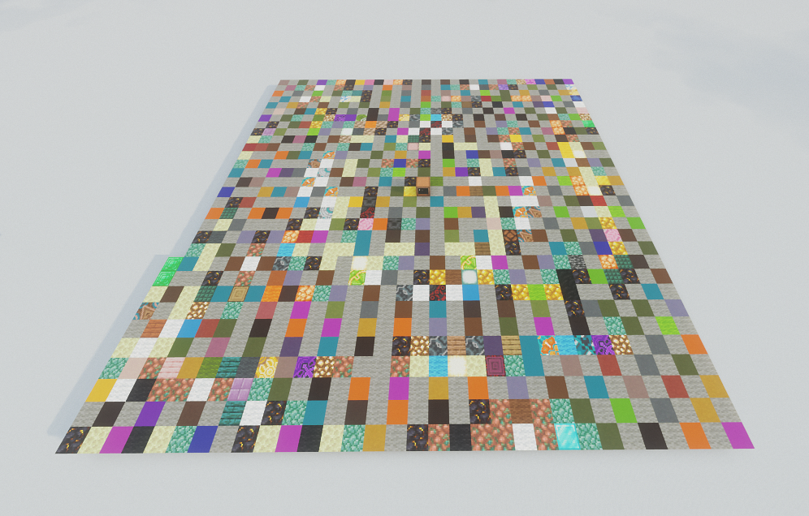

# SerdeCraft

A Rust library that serializes and deserializes data structures into Minecraft blocks using the Serde framework. SerdeCraft enables you to visualize complex data structures in Minecraft by converting them into sequences of blocks that are placed in the world via WebSocket communication with ComputerCraft computers.



## Features

- **Serde Integration**: Serialize any Rust data structure that implements `Serialize` and deserialize them back with `Deserialize`
- **Minecraft Block Mapping**: Converts data types into meaningful Minecraft blocks (logs for digits, wool colors for types, etc.)
- **WebSocket Communication**: Real-time communication with ComputerCraft computers in Minecraft
- **Bidirectional**: Both serialization (placing blocks) and deserialization (reading blocks) supported
- **Spiral Pattern**: Blocks are placed in an expanding spiral pattern for optimal visualization

## How It Works

1. **Serialization**: Rust data structures are converted into sequences of Minecraft blocks
2. **WebSocket**: Block sequences are sent via WebSocket to a ComputerCraft computer
3. **Block Placement**: The CC computer receives block names and places them in a spiral pattern
4. **Deserialization**: The process can be reversed to read block patterns back into data structures

## Block Encoding

Different data types are encoded using specific Minecraft blocks:

- **Numbers**: Various log types (Cherry, Bamboo, Birch, Oak, Jungle, etc.)
- **Strings**: Combinations of blocks representing characters
- **Enums**: Different colored wool blocks
- **Collections**: Terracotta and glass blocks for structure

## Quick Start

### Prerequisites

- Rust (Edition 2024)
- Minecraft with ComputerCraft: Tweaked mod
- A ComputerCraft computer in your Minecraft world

### Installation

Add SerdeCraft to your `Cargo.toml`:

```toml
[dependencies]
serdecraft = "0.1.0"
```

### Basic Usage

```rust
use serdecraft::{MinecraftSerializer, MinecraftDeserializer, MinecraftResult};
use serde::{Serialize, Deserialize};
use std::net::TcpListener;
use tungstenite::accept;

#[derive(Serialize, Deserialize, Debug)]
struct Player {
    id: u32,
    username: String,
    health: f64,
}

fn main() -> MinecraftResult<()> {
    let player = Player {
        id: 12345,
        username: "Steve".to_string(),
        health: 100.0,
    };

    // Start WebSocket server
    let server = TcpListener::bind("127.0.0.1:8765")?;
    
    for stream in server.incoming() {
        let mut websocket = accept(stream?).unwrap();
        
        // Wait for command from ComputerCraft
        let message = websocket.read()?.to_text()?;
        
        match message {
            "ser" => {
                // Serialize data to blocks
                let mut serializer = MinecraftSerializer::new(websocket);
                player.serialize(&mut serializer)?;
            }
            "de" => {
                // Deserialize blocks back to data
                let mut deserializer = MinecraftDeserializer::new(websocket);
                let player: Player = Player::deserialize(&mut deserializer)?;
                println!("Deserialized: {:#?}", player);
            }
            _ => println!("Unknown command"),
        }
    }
    
    Ok(())
}
```

### ComputerCraft Setup

1. Place the provided Lua scripts on your ComputerCraft computer:
   - `ser.lua` - For serialization (placing blocks)
   - `de.lua` - For deserialization (reading blocks)
   - `utils.lua` - Utility functions

2. Run the appropriate script:
   ```lua
   -- For serialization
   ser
   
   -- For deserialization
   de
   ```

## ComputerCraft Scripts

### `ser.lua`
Connects to the WebSocket server and receives block placement commands. Places blocks in an expanding spiral pattern starting from a configured position.

### `de.lua`
Reads blocks from the world in the same spiral pattern and sends the block information back to the Rust application for deserialization.

### `utils.lua`
Provides utility functions for:
- Movement calculations (forward/backward in cardinal directions)
- Block placement at specific coordinates
- Direction management for spiral patterns

## Configuration

The default WebSocket address is `ws://localhost:8765`. You can modify this in both the Rust code and ComputerCraft scripts.

The starting position for block placement is configurable in the Lua scripts:
```lua
local start = {-1, 56, 0}  -- x, y, z coordinates
```

## Supported Data Types

- Primitive types: `u8`, `u16`, `u32`, `u64`, `i8`, `i16`, `i32`, `i64`, `f32`, `f64`
- Strings and characters
- Booleans
- Options and Results
- Vectors and arrays
- Structs and enums
- Maps and sequences
- Nested structures
- May implement others by your request

## Error Handling

SerdeCraft uses a custom error type `MinecraftError` that handles:
- WebSocket communication errors
- Serialization/deserialization errors
- Block placement failures
- Network connectivity issues

## Contributing

Contributions are welcome! Please feel free to submit a Pull Request. For major changes, please open an issue first to discuss what you would like to change.

## License

This project is available under the MIT License. See the LICENSE file for more details.

## Examples

See the `examples/` directory for more usage examples:
- Basic serialization and deserialization
- Complex nested structures
- Custom data types

## Troubleshooting

1. **WebSocket connection fails**: Ensure Minecraft is running and the ComputerCraft computer has internet access
3. **Deserialization errors**: Ensure the block pattern hasn't been modified between serialization and deserialization